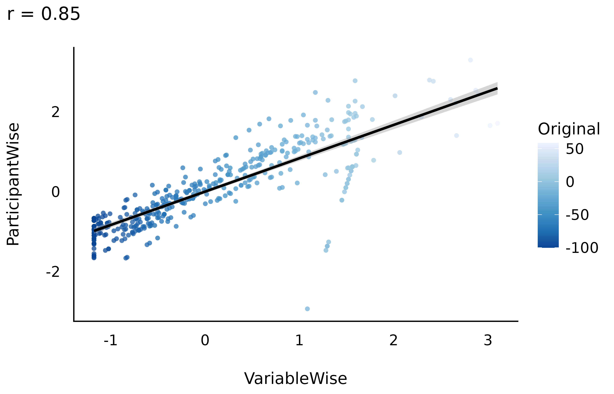

# Data Standardization

This vignette can be referred to by citing the following:

> Patil et al., (2022). datawizard: An R Package for Easy Data
> Preparation and Statistical Transformations. *Journal of Open Source
> Software*, *7*(78), 4684, <https://doi.org/10.21105/joss.04684>

## Introduction

To make sense of their data and effects, scientists might want to
standardize (Z-score) their variables. This makes the data unitless,
expressed only in terms of deviation from an index of centrality (e.g.,
the mean or the median). However, aside from some benefits,
standardization also comes with challenges and issues, that the
scientist should be aware of.

### Methods of Standardization

The `datawizard` package offers two methods of standardization via the
[`standardize()`](https://easystats.github.io/datawizard/reference/standardize.md)
function:

- **Normal standardization**: center around the *mean*, with *SD* units
  (default).

- **Robust standardization**: center around the *median*, with *MAD*
  (median absolute deviation) units (`robust = TRUE`).

Let’s look at the following example:

``` r

library(datawizard)
library(effectsize) # for data

# let's have a look at what the data look like
data("hardlyworking", package = "effectsize")
head(hardlyworking)
```

    #>     salary xtra_hours n_comps age seniority is_senior
    #> 1 19744.65       4.16       1  32         3     FALSE
    #> 2 11301.95       1.62       0  34         3     FALSE
    #> 3 20635.62       1.19       3  33         5      TRUE
    #> 4 23047.16       7.19       1  35         3     FALSE
    #> 5 27342.15      11.26       0  33         4     FALSE
    #> 6 25656.63       3.63       2  30         5      TRUE

``` r

# let's use both methods of standardization
hardlyworking$xtra_hours_z <- standardize(hardlyworking$xtra_hours)
hardlyworking$xtra_hours_zr <- standardize(hardlyworking$xtra_hours, robust = TRUE)
```

We can see that different methods give different central and variation
values:

``` r

library(dplyr)

hardlyworking %>%
  select(starts_with("xtra_hours")) %>%
  data_to_long() %>%
  group_by(Name) %>%
  summarise(
    mean = mean(Value),
    sd = sd(Value),
    median = median(Value),
    mad = mad(Value)
  )
```

| name          |   mean |     sd |  median |    mad |
|:--------------|-------:|-------:|--------:|-------:|
| xtra_hours    | 3.9756 | 3.9037 |  2.7700 | 2.8466 |
| xtra_hours_z  | 0.0000 | 1.0000 | -0.3088 | 0.7292 |
| xtra_hours_zr | 0.4235 | 1.3714 |  0.0000 | 1.0000 |

[`standardize()`](https://easystats.github.io/datawizard/reference/standardize.md)
can also be used to standardize a full data frame - where each numeric
variable is standardized separately:

``` r

hardlyworking_z <- standardize(hardlyworking)
```

``` r

hardlyworking_z %>%
  select(-xtra_hours_z, -xtra_hours_zr) %>%
  data_to_long() %>%
  group_by(Name) %>%
  summarise(
    mean = mean(Value),
    sd = sd(Value),
    median = median(Value),
    mad = mad(Value)
  )
```

| name       | mean |     sd |  median |    mad |
|:-----------|-----:|-------:|--------:|-------:|
| age        | 0.00 | 1.0000 |  0.0605 | 1.2461 |
| is_senior  | 0.44 | 0.4969 |  0.0000 | 0.0000 |
| n_comps    | 0.00 | 1.0000 | -0.0606 | 1.7968 |
| salary     | 0.00 | 1.0000 | -0.1619 | 0.8640 |
| seniority  | 0.00 | 1.0000 | -0.3681 | 1.2931 |
| xtra_hours | 0.00 | 1.0000 | -0.3088 | 0.7292 |

Weighted standardization is also supported via the `weights` argument,
and factors can also be standardized (if you’re into that kind of thing)
by setting `force = TRUE`, which converts factors to treatment-coded
dummy variables before standardizing.

### Variable-wise *vs.* Participant-wise

Standardization is an important step and extra caution is required in
**repeated-measures designs**, in which there are three ways of
standardizing data:

- **Variable-wise**: The most common method. A simple scaling of each
  column.

- **Participant-wise**: Variables are standardized “within” each
  participant, *i.e.*, for each participant, by the participant’s mean
  and SD.

- **Full**: Participant-wise first and then re-standardizing
  variable-wise.

Unfortunately, the method used is often not explicitly stated. This is
an issue as these methods can generate important discrepancies (that can
in turn contribute to the reproducibility crisis). Let’s investigate
these 3 methods.

#### The Data

We will take the `emotion` dataset in which participants were exposed to
negative pictures and had to rate their emotions (**valence**) and the
amount of memories associated with the picture (**autobiographical
link**). One could make the hypothesis that for young participants with
no context of war or violence, the most negative pictures (mutilations)
are less related to memories than less negative pictures (involving for
example car crashes or sick people). In other words, **we expect a
positive relationship between valence** (with high values corresponding
to less negativity) **and autobiographical link**.

Let’s have a look at the data, averaged by participants:

``` r

# Download the 'emotion' dataset
load(url("https://raw.githubusercontent.com/neuropsychology/psycho.R/master/data/emotion.rda"))

# Discard neutral pictures (keep only negative)
emotion <- emotion %>% filter(Emotion_Condition == "Negative")

# Summary
emotion %>%
  drop_na(Subjective_Valence, Autobiographical_Link) %>%
  group_by(Participant_ID) %>%
  summarise(
    n_Trials = n(),
    Valence_Mean = mean(Subjective_Valence),
    Valence_SD = sd(Subjective_Valence)
  )
```

    #> # A tibble: 19 × 4
    #> # Groups:   Participant_ID [19]
    #>    Participant_ID n_Trials Valence_Mean Valence_SD
    #>    <fct>             <int>        <dbl>      <dbl>
    #>  1 10S                  24       -58.1       42.6 
    #>  2 11S                  24       -73.2       37.0 
    #>  3 12S                  24       -57.5       26.6 
    #>  4 13S                  24       -63.2       23.7 
    #>  5 14S                  24       -56.6       26.5 
    #>  6 15S                  24       -60.6       33.7 
    #>  7 16S                  24       -46.1       24.9 
    #>  8 17S                  24        -1.54       4.98
    #>  9 18S                  24       -67.2       35.0 
    #> 10 19S                  24       -59.6       33.2 
    #> 11 1S                   24       -53.0       42.9 
    #> 12 2S                   23       -43.0       39.2 
    #> 13 3S                   24       -64.3       34.4 
    #> 14 4S                   24       -81.6       27.6 
    #> 15 5S                   24       -58.1       25.3 
    #> 16 6S                   24       -74.7       29.2 
    #> 17 7S                   24       -62.3       39.7 
    #> 18 8S                   24       -56.9       32.7 
    #> 19 9S                   24       -31.5       52.7

As we can see from the means and SDs, there is a lot of variability
**between** participants both in their means and their individual
*within*-participant SD.

#### Effect of Standardization

We will create three data frames standardized with each of the three
techniques.

``` r

Z_VariableWise <- emotion %>%
  standardize()

Z_ParticipantWise <- emotion %>%
  group_by(Participant_ID) %>%
  standardize()

Z_Full <- emotion %>%
  group_by(Participant_ID) %>%
  standardize() %>%
  ungroup() %>%
  standardize()
```

Let’s see how these three standardization techniques affected the
**Valence** variable.

#### Across Participants

We can calculate the mean and SD of *Valence* across all participants:

``` r

# Create a convenient function to print
summarise_Subjective_Valence <- function(data) {
  df_name <- deparse(substitute(data))
  data %>%
    ungroup() %>%
    summarise(
      DF = df_name,
      Mean = mean(Subjective_Valence),
      SD = sd(Subjective_Valence)
    )
}
# Check the results
rbind(
  summarise_Subjective_Valence(Z_VariableWise),
  summarise_Subjective_Valence(Z_ParticipantWise),
  summarise_Subjective_Valence(Z_Full)
)
```

| DF                | Mean |   SD |
|:------------------|-----:|-----:|
| Z_VariableWise    |    0 | 1.00 |
| Z_ParticipantWise |    0 | 0.98 |
| Z_Full            |    0 | 1.00 |

The **means** and the **SD** appear as fairly similar (0 and 1)…

``` r

library(see)
library(ggplot2)

ggplot() +
  geom_density(aes(Z_VariableWise$Subjective_Valence,
    color = "Z_VariableWise"
  ), linewidth = 1) +
  geom_density(aes(Z_ParticipantWise$Subjective_Valence,
    color = "Z_ParticipantWise"
  ), linewidth = 1) +
  geom_density(aes(Z_Full$Subjective_Valence,
    color = "Z_Full"
  ), linewidth = 1) +
  see::theme_modern() +
  labs(color = "")
```


and so do the marginal distributions…

#### At the Participant Level

However, we can also look at what happens in the participant level.
Let’s look at the first 5 participants:

``` r

# Create convenient function
print_participants <- function(data) {
  df_name <- deparse(substitute(data))
  data %>%
    group_by(Participant_ID) %>%
    summarise(
      DF = df_name,
      Mean = mean(Subjective_Valence),
      SD = sd(Subjective_Valence)
    ) %>%
    head(5) %>%
    select(DF, everything())
}

# Check the results
rbind(
  print_participants(Z_VariableWise),
  print_participants(Z_ParticipantWise),
  print_participants(Z_Full)
)
```

| DF                | Participant_ID |  Mean |   SD |
|:------------------|:---------------|------:|-----:|
| Z_VariableWise    | 10S            | -0.05 | 1.15 |
| Z_VariableWise    | 11S            | -0.46 | 1.00 |
| Z_VariableWise    | 12S            | -0.03 | 0.72 |
| Z_VariableWise    | 13S            | -0.19 | 0.64 |
| Z_VariableWise    | 14S            | -0.01 | 0.71 |
| Z_ParticipantWise | 10S            |  0.00 | 1.00 |
| Z_ParticipantWise | 11S            |  0.00 | 1.00 |
| Z_ParticipantWise | 12S            |  0.00 | 1.00 |
| Z_ParticipantWise | 13S            |  0.00 | 1.00 |
| Z_ParticipantWise | 14S            |  0.00 | 1.00 |
| Z_Full            | 10S            |  0.00 | 1.02 |
| Z_Full            | 11S            |  0.00 | 1.02 |
| Z_Full            | 12S            |  0.00 | 1.02 |
| Z_Full            | 13S            |  0.00 | 1.02 |
| Z_Full            | 14S            |  0.00 | 1.02 |

Seems like *full* and *participant-wise* standardization give similar
results, but different ones than *variable-wise* standardization.

#### Compare

Let’s do a **correlation** between the **variable-wise and
participant-wise methods**.

``` r

r <- cor.test(
  Z_VariableWise$Subjective_Valence,
  Z_ParticipantWise$Subjective_Valence
)

data.frame(
  Original = emotion$Subjective_Valence,
  VariableWise = Z_VariableWise$Subjective_Valence,
  ParticipantWise = Z_ParticipantWise$Subjective_Valence
) %>%
  ggplot(aes(x = VariableWise, y = ParticipantWise, colour = Original)) +
  geom_point(alpha = 0.75, shape = 16) +
  geom_smooth(method = "lm", color = "black") +
  scale_color_distiller(palette = 1) +
  ggtitle(paste0("r = ", round(r$estimate, 2))) +
  see::theme_modern()
```



While the three standardization methods roughly present the same
characteristics at a general level (mean 0 and SD 1) and a similar
distribution, their values are not exactly the same!

Let’s now answer the original question by investigating the **linear
relationship between valence and autobiographical link**. We can do this
by running a mixed-effects model with participants entered as random
effects.

``` r

library(lme4)
m_raw <- lmer(
  formula = Subjective_Valence ~ Autobiographical_Link + (1 | Participant_ID),
  data = emotion
)
m_VariableWise <- update(m_raw, data = Z_VariableWise)
m_ParticipantWise <- update(m_raw, data = Z_ParticipantWise)
m_Full <- update(m_raw, data = Z_Full)
```

We can extract the parameters of interest from each model, and find:

``` r

# Convenient function
get_par <- function(model) {
  mod_name <- deparse(substitute(model))
  parameters::model_parameters(model) %>%
    mutate(Model = mod_name) %>%
    select(-Parameter) %>%
    select(Model, everything()) %>%
    .[-1, ]
}

# Run the model on all datasets
rbind(
  get_par(m_raw),
  get_par(m_VariableWise),
  get_par(m_ParticipantWise),
  get_par(m_Full)
)
```

    #> # Fixed Effects
    #> 
    #> Model             | Coefficient |   SE |        95% CI | t(451) |     p
    #> -----------------------------------------------------------------------
    #> m_raw             |        0.09 | 0.07 | [-0.04, 0.22] |   1.36 | 0.174
    #> m_VariableWise    |        0.07 | 0.05 | [-0.03, 0.17] |   1.36 | 0.174
    #> m_ParticipantWise |        0.08 | 0.05 | [-0.01, 0.17] |   1.75 | 0.080
    #> m_Full            |        0.08 | 0.05 | [-0.01, 0.17] |   1.75 | 0.080
    #> 
    #> # Random Effects: Participant_ID
    #> 
    #> Model             | Coefficient
    #> -------------------------------
    #> m_raw             |       16.49
    #> m_VariableWise    |        0.45
    #> m_ParticipantWise |        0.00
    #> m_Full            |        0.00
    #> 
    #> # Random Effects: Residual
    #> 
    #> Model             | Coefficient
    #> -------------------------------
    #> m_raw             |       33.56
    #> m_VariableWise    |        0.91
    #> m_ParticipantWise |        0.98
    #> m_Full            |        1.00

As we can see, **variable-wise** standardization only affects **the
coefficient** (which is expected, as it changes the unit), but not the
test statistic or statistical significance. However, using
**participant-wise** standardization *does* affect the coefficient
**and** the significance.

**No method is better or more justified, and the choice depends on the
specific case, context, data and goal.**

#### Conclusion

1.  **Standardization can be useful in *some* cases and should be
    justified**.

2.  **Variable and Participant-wise standardization methods *appear* to
    produce similar data**.

3.  **Variable and Participant-wise standardization can lead to
    different results**.

4.  **The chosen method can strongly influence the results and should
    therefore be explicitly stated and justified to enhance
    reproducibility of results**.

We showed here yet another way of **sneakily tweaking the data** that
can change the results. To prevent its use as a bad practice, we can
only highlight the importance of open data, open analysis/scripts, and
preregistration.

## See also

- [`datawizard::demean()`](https://easystats.github.io/datawizard/reference/demean.md):
  <https://easystats.github.io/datawizard/reference/demean.html>
- `standardize_parameters(method = "pseudo")` for mixed-effects models
  <https://easystats.github.io/parameters/articles/standardize_parameters_effsize.html>

## References
